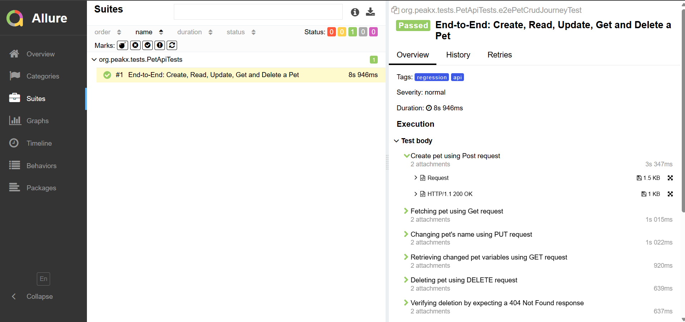

# Pet Store API Test Automation

An End-to-End API test automation framework built for the Swagger Petstore API. This project demonstrates modern Quality Assurance practices, clean architecture, and robust reporting capabilities.

## Tech Stack

* **Language:** Java 21
* **Framework:** Spring Boot 3
* **API Client:** RestAssured
* **Testing Framework:** JUnit 5
* **Assertions:** AssertJ (Recursive Comparison)
* **Data Generation:** Datafaker
* **Reporting:** Allure Reports

## Architectural Highlights

* **Single-Scenario E2E Flow (Fail-Fast):** Instead of fragmented, inter-dependent tests, the CRUD operations are consolidated into a single End-to-End user journey. This prevents cascading failures and ensures absolute test isolation without relying on static shared states.
* **Dynamic Test Data:** Leveraging `Datafaker` to generate randomized, realistic payload data for every test run, ensuring the system is tested against diverse inputs.
* **Advanced Assertions:** Utilizing AssertJ's `usingRecursiveComparison()` for deep, object-level validation rather than repetitive field-by-field assertions.
* **Structured Logging:** Implemented a clear Separation of Concerns in logging (INFO for Business Logic/Service layer, DEBUG for HTTP Client/Network layer).

## How to Run

### Prerequisites
* Java 21 installed
* Maven installed

### Execution
To run the test suite and generate the raw data:

```bash
mvn clean test
```

## Allure Reporting

This framework is fully integrated with Allure to provide rich, step-by-step visual reports, including attached HTTP Requests and Responses.

To generate and serve the HTML report locally after running the tests, execute:

```bash
mvn allure:serve
```

